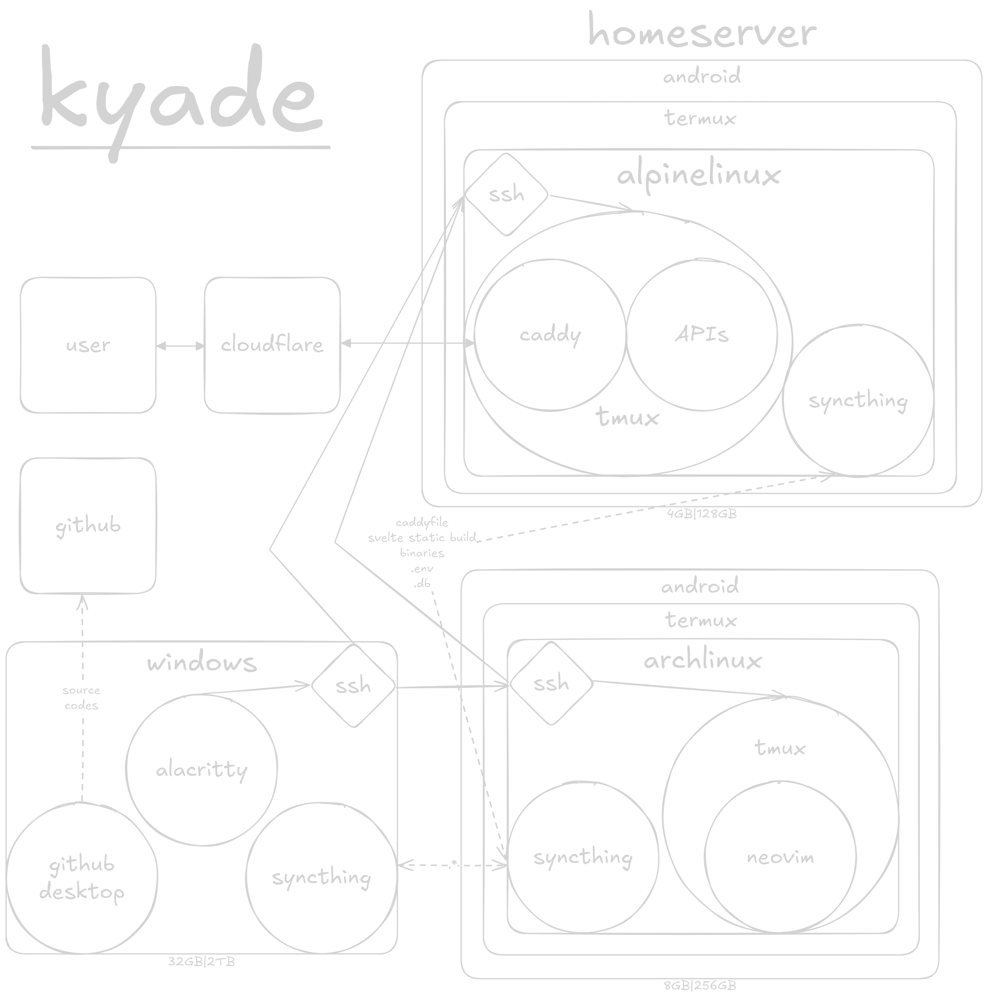

# kyaruwo's development environment (kyade)

<br />

### why?

- I want to separate my development environment from my gaming environment.

<br />

##### todo!

- [x] setup devenv
- [ ] setup [stackoyaki](https://github.com/kyaruwo/stackoyaki) development
- [ ] setup new homeserver
- [ ] migrate [old homeserver](https://github.com/kyaruwo/termux.config)
- [ ] create a devenv install script that includes my [dotfiles](https://github.com/kyaruwo/dotfiles)

<br />

<details><summary>kyade visualization</summary>

</details>

<br />

<details><summary>prerequisite</summary>

## hardware

- 2 android devices
- 1 tri-mode keyboard
- 1 windows device

<br />

## software

### android

- [termux](https://github.com/termux/termux-app)

### windows

- [alacritty](https://github.com/kyaruwo/dotfiles/tree/main/windows/alacritty)
- [syncthing](https://github.com/kyaruwo/dotfiles/tree/main/windows/syncthing)
- [github desktop](https://desktop.github.com/download/)

</details>

<br />

<details><summary>devenv installation</summary>

#### termux

```bash
pkg update && pkg upgrade
```

#### distro

```bash
pkg i proot-distro
```

```bash
pd i archlinux
```

#### login as root

```bash
pd login archlinux
```

#### archlinux (logged in as root)

```bash
pacman -Syu
```

#### packages (logged in as root)

```bash
pacman -S sudo openssh git make unzip gcc ripgrep fd tmux neovim syncthing neofetch
```

#### user (logged in as root)

```bash
useradd -m -G wheel kyaruwo
```

```bash
passwd kyaruwo
```

```bash
sed -i "/^root/a\kyaruwo ALL=(ALL:ALL) ALL" /etc/sudoers
```

```bash
logout
```

#### autologin as kyaruwo on archlinux when termux run

```bash
echo -e "\nclear\npd sh archlinux --user kyaruwo" >> /data/data/com.termux/files/usr/etc/bash.bashrc
```

#### login as kyaruwo

```bash
pd login archlinux --user kyaruwo
```

#### ssh (logged in as kyaruwo)

```bash
ssh-keygen
```

```bash
echo -e "\nPort 10122" >> /etc/ssh/sshd_config
```

```bash
echo "HostKey /home/kyaruwo/.ssh/id_ed25519" >> /etc/ssh/sshd_config
```

#### sshd (logged in as kyaruwo)

```bash
echo -e "\nalias sshd='sudo /usr/sbin/sshd'" >> ~/.bashrc
```

#### tmux on ssh (logged in as kyaruwo)

```bash
echo -e '\nif [[ $- =~ i ]] && [[ -z "$TMUX" ]] && [[ -n "$SSH_TTY" ]]; then\n\ttmux new -A -s owo\nfi' >> ~/.bashrc
```

#### neovim (logged in as kyaruwo)

- kickstart

```bash
git clone https://github.com/nvim-lua/kickstart.nvim.git ~/.config/nvim
```

- retrobox colorscheme

```bash
sed -i -e "s/tokyonight-night/retrobox/" ~/.config/nvim/init.lua
```

#### syncthing (logged in as kyaruwo)

```bash
syncthing
```

</details>

<br />

<details><summary>devenv</summary>

### windows

android - ssh (server)

```bash
sshd
```

windows - alacritty (client)

- connect

```sh
ssh -p 10122 kyaruwo@ip_address
```

- disconnect

press `Enter` + `~` + `.`

<br />

### android

tmux

```bash
tmux new -A -s owo
```

</details>

<br />

<details><summary>stackoyaki installation</summary>
</details>

<br />

<details><summary>homeserver installation</summary>
</details>

<br />

<details><summary>homeserver</summary>
</details>
